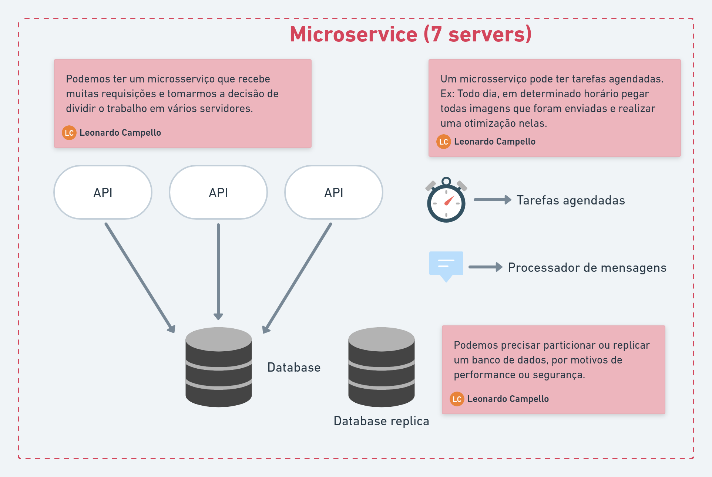

# Componentes de um microsserviço

> De que é composto um microsserviço?

Sabemos que cada microsserviço deve ser dono e gerenciar seus próprios dados. Então será que um microsserviço é um único processo rodando em um único servidor?

  

Uma máquina (servidor) pode ser considerada um componente de microsserviço. Várias aplicações em uma mesma máquina podem ser vários componentes. Um serviço de apoio (como banco de dados ou fila de mensageria) pode ser um componente. Qualquer coisa que efetivamente componha o microsserviço, é um componente.
